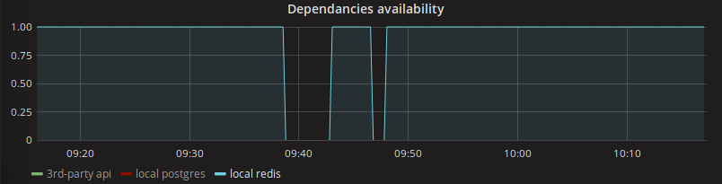

# Booster for aiohttp

<br><br>
<div style="text-align: right">Dmitry Burakov</div>
<div style="text-align: right">2018</div>

---

## The most expensive resource

#### What is it?

+++

## Its' YOU!

+++


+++

| Operation          | Time      | Scaled time |
|--------------------|-----------|-------------|
| 1 CPU cycle        | 0.3 ns    | 1 s         |
| RAM I/O            | 120 ns    | 6 min       |
| SSD I/O            | 50-150 μs | 2-6 days    |
| HDD I/O            | 1-10 ms   | 1-12 months |
| Network: inside DC | 3 ms      | 3 months    |
| Internet: US to EU | 81 ms     | 8 years     |

---

### Types of services:

- HTTP API
- Worker

---

### A new service TODO:

- 

---

### aioamqp-ext

+++

### Producer

```python
from aioamqp_ext import BaseProducer

producer = BaseProducer(**{
    'url': 'amqp://localhost:5672/',
    'exchange': 'my_exchange'
})

producer.publish_message(
    payload='foo',
    routing_key='bar'
)

producer.close()
```

@[1]
@[3-6]
@[8-11]
@[13]

+++

### Consumer

```python
from aioamqp_ext import BaseConsumer

class Consumer(BaseConsumer):
    async def process_request(self, data):
        print(data)

if __name__ == "__main__":
    consumer = Consumer(**{
        'url': 'amqp://localhost:5672/',
        'exchange': 'my_exchange',
        'queue': 'my_queue',
        'routing_key': 'foo.bar'
    })
    try:
        loop = asyncio.get_event_loop()
        loop.run_until_complete(consumer.consume())
        loop.run_forever()
    except KeyboardInterrupt:
        loop.run_until_complete(consumer.close())
    finally:
        loop.close()
```

@[1]
@[3-5]
@[8-13]
@[14-21]

---

### aiohttp_prometheus_monitoring

It can monitor:

- external host HTTP status
- postgres database status
- redis availability
- rabbit AMQP availability
- whatever else, as can be extended easily

+++


+++

### Configuring

```
MONITORING = {
    'route_ping': '/ping',
    'route_metrics': '/metrics',

    'metrics': [
        {
            'name': 'monitoring_http',
            'description': 'Check HTTP status',
            'module': 'aiohttp_prometheus_monitoring.metrics.http.HttpMetric',
            'sleep_time': 300,
            'params': {
                'url': 'http://localhost/my_ping/',
                'timeout': 1,
                'verify_ssl': True,
            }
        },
        {
            'name': 'monitoring_redis',
            'description': 'Check redis connection',
            'module': 'aiohttp_prometheus_monitoring.metrics.redis.RedisMetric',
            'sleep_time': 60,
            'params': {
                'host': 'localhost',
                'port': '6379',
            }
        },
        {
            'name': 'monitoring_mq',
            'description': 'Check MQ connection',
            'module': 'aiohttp_prometheus_monitoring.metrics.amqp.AmqpMetric',
            'sleep_time': 60,
            'params': {
                'host': 'localhost',
                'port': '5672',
                'user': 'root',
                'password': '123',
                'vhost': 'myvhost',
            }
        },
        {
            'name': 'monitoring_postgres',
            'description': 'Check postgres connection',
            'module': 'aiohttp_prometheus_monitoring.metrics.postgres.PostgresMetric',
            'sleep_time': 60,
            'params': {
                'database': 'core',
                'user': 'core',
                'password': 'core',
                'host': 'localhost',
                'port': 5433,
            }
        },
    ]
}
```

@[2-3]
@[6-16]
@[17-26]
@[27-39]
@[40-52]

+++

### Install

```
pip install aiohttp_prometheus_monitoring[amqp,redis,postgres]
```

+++

### Setup

```python
from aiohttp import web
from aiohttp_prometheus_monitoring import setup_monitoring

def create_app(loop=None):    
    app = web.Application()
    loop.run_until_complete(setup_monitoring(settings.MONITORING, app))
    
    return app
```

+++

### /metrics

```
# HELP monitoring_http Check HTTP status
# TYPE monitoring_http gauge
monitoring_http 1.0
# HELP monitoring_redis Check redis connection
# TYPE monitoring_redis gauge
monitoring_redis 1.0
# HELP monitoring_mq Check MQ connection
# TYPE monitoring_mq gauge
monitoring_mq 1.0
# HELP monitoring_postgres Check postgres connection
# TYPE monitoring_postgres gauge
monitoring_postgres 1.0
```

+++

### grafana



---

Presentation: https://gitpitch.com/dburakov/aiolibs

Libs: https://github.com/wgnet?q=aio

Links:

- https://blog.codinghorror.com/the-infinite-space-between-words/
- https://hackernoon.com/yes-python-is-slow-and-i-dont-care-13763980b5a1

